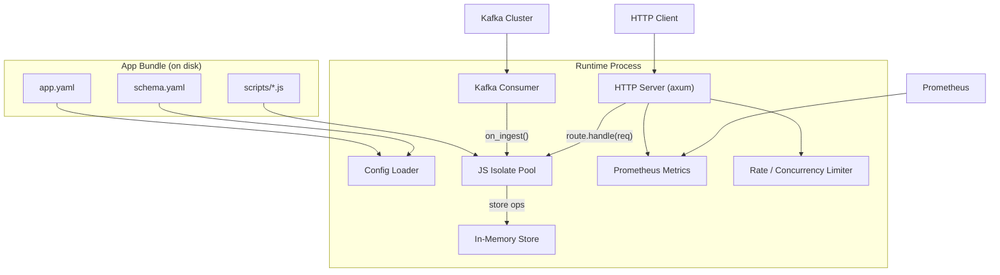

# Stateful Edge Runtime MVP Implementation Plan

## Architecture Overview




## Project Structure

```
stateful-runtime/
├── Cargo.toml
├── src/
│   ├── main.rs              # Entry point, wiring
│   ├── config/
│   │   ├── mod.rs            # Config loading + validation
│   │   ├── app.rs            # app.yaml types
│   │   └── schema.rs         # schema.yaml types
│   ├── store/
│   │   ├── mod.rs            # Store trait + implementation
│   │   ├── entity.rs         # Entity types
│   │   ├── index.rs          # Hash + sorted indexes
│   │   └── retention.rs      # TTL + eviction sweeper
│   ├── js/
│   │   ├── mod.rs            # Isolate pool manager
│   │   ├── ops.rs            # Custom deno_core ops (store bindings)
│   │   └── runtime.rs        # JsRuntime creation + script loading
│   ├── ingestion/
│   │   ├── mod.rs            # Ingestion coordinator
│   │   └── kafka.rs          # Kafka consumer (rdkafka)
│   ├── http/
│   │   ├── mod.rs            # HTTP server (axum)
│   │   ├── router.rs         # Dynamic endpoint routing
│   │   ├── health.rs         # /healthz, /readyz
│   │   └── admin.rs          # Admin endpoints
│   ├── limits/
│   │   ├── mod.rs            # Resource limits enforcement
│   │   └── rate_limiter.rs   # Token bucket rate limiter
│   └── metrics/
│       └── mod.rs            # Prometheus registry + collectors
├── examples/
│   ├── ads-counter/          # Example app: ads counter
│   └── feed/                 # Example app: social feed
└── deploy/
    └── systemd/              # systemd unit example
```

## Dependencies to Add

Current `Cargo.toml` has `capnp`, `dashmap`, `deno_core`, `tokio`. We need to add:

- **axum** + **tower** + **tower-http** -- HTTP server and middleware
- **rdkafka** -- Kafka consumer (librdkafka wrapper)
- **serde** + **serde_yaml** + **serde_json** -- Config and data serialization
- **prometheus** -- Metrics exposition
- **tracing** + **tracing-subscriber** -- Structured logging
- **uuid** -- Request IDs
- **clap** -- CLI argument parsing (app bundle path, config overrides)
- **anyhow** / **thiserror** -- Error handling

Also fix `edition = "2024"` to `edition = "2021"`.

---

## Implementation Phases (matching PRD milestones)

### Phase 0: Foundation and Core Modules

#### 0.1 Config Loader (`[src/config/](src/config/)`)

- Define `AppConfig` and `SchemaConfig` structs with serde derives
- `AppConfig`: app metadata, limits (concurrency, rate, JS pool, store budget), ingestion sources, endpoint definitions, format settings
- `SchemaConfig`: entity definitions with fields, index declarations (hash/sorted), retention policies (TTL per entity or per index)
- Validate on load: endpoint path uniqueness, referenced handler files exist, limit values sane, schema index references valid fields
- Fail fast with actionable error messages

#### 0.2 In-Memory Store (`[src/store/](src/store/)`)

- **Entity storage**: `DashMap<String, DashMap<String, Entity>>` -- outer key is entity type, inner key is primary key
- **Hash indexes**: `DashMap<String, DashMap<Value, HashSet<String>>>` -- index name -> value -> set of PKs
- **Sorted indexes**: `DashMap<String, BTreeMap<SortKey, Vec<String>>>` -- index name -> sorted key -> PKs (behind a `RwLock` since `DashMap` doesn't support range queries)
- Operations: `upsert`, `delete`, `get`, `batch_get`, `index_lookup`, `range_lookup`
- On upsert: update all relevant indexes atomically; on delete: remove from all indexes + insert tombstone
- Memory tracking: approximate size accounting on insert/delete

#### 0.3 Retention and Eviction (`[src/store/retention.rs](src/store/retention.rs)`)

- Background `tokio::spawn` sweeper task running on configurable interval
- Checks entity timestamps against TTL policies from schema config
- Evicts expired entities from primary store AND all indexes (FR-5 correctness)
- Tombstone cleanup: remove tombstones older than `tombstone_ttl_seconds`
- Emit eviction count metrics

#### 0.4 JS Isolate Pool (`[src/js/](src/js/)`)

- Pool of `deno_core::JsRuntime` instances (pool size from `app.yaml`)
- Atomic dispatch (not mutex round-robin, per PRD Phase 0 fix)
- Each isolate created with:
  - V8 heap limit (`memory_limit_bytes` from config)
  - Custom ops registered for store access (`op_store_get`, `op_store_upsert`, `op_store_delete`, `op_store_query`, `op_store_range`)
  - Preloaded handler scripts from the app bundle
- CPU budget enforcement: `tokio::time::timeout` wrapping each JS call with `max_cpu_ms_per_request`
- On violation: terminate isolate, respawn, return error

Custom ops in `src/js/ops.rs`:

- `#[op2] op_store_get(entity_type, key) -> Result<Value>`
- `#[op2] op_store_upsert(entity_type, key, value) -> Result<()>`
- `#[op2] op_store_delete(entity_type, key) -> Result<()>`
- `#[op2] op_store_index_lookup(index_name, value) -> Result<Vec<Value>>`
- `#[op2] op_store_range_lookup(index_name, start, end, limit) -> Result<Vec<Value>>`

### Phase 1: Ingestion + HTTP + Observability

#### 1.1 Kafka Ingestion (`[src/ingestion/](src/ingestion/)`)

- `rdkafka::consumer::StreamConsumer` with stable group id from `app.yaml` (not per-thread)
- Subscribe to topics defined in `app.yaml`
- Parse messages as JSON (MVP)
- Dispatch to JS `on_ingest(eventType, data, context)` via isolate pool
- Apply resulting store ops
- Concurrency limiter: `tokio::sync::Semaphore` bounding in-flight ingestion work
- Commit offsets after successful processing (at-least-once)
- Expose ingestion lag and throughput metrics

#### 1.2 HTTP Edge Server (`[src/http/](src/http/)`)

- `axum::Router` built dynamically from `app.yaml` endpoint definitions
- Each endpoint maps to a JS handler file
- Request flow:
  1. Rate limit check (token bucket from `src/limits/`)
  2. Concurrency semaphore acquire
  3. Parse request -> build JS-friendly request object `{ method, path, params, query, headers, body }`
  4. Dispatch to JS `route.handle(request)` -> `{ status, headers, body }`
  5. Build HTTP response from JS result
- Payload size limits enforced via `tower-http::limit::RequestBodyLimitLayer`
- Request ID generation and propagation (`x-request-id` header)
- Separate listener ports for edge vs admin (or path-prefix separation)

#### 1.3 Health Endpoints (`[src/http/health.rs](src/http/health.rs)`)

- `/healthz` -- liveness: process alive, always 200 if server is listening
- `/readyz` -- readiness: config loaded, scripts loaded, store initialized, Kafka subscribed (if configured)
- Return JSON with component statuses

#### 1.4 Prometheus Metrics (`[src/metrics/](src/metrics/)`)

- `prometheus::Registry` with:
  - `http_requests_total` counter (labels: endpoint, method, status)
  - `http_request_duration_seconds` histogram (labels: endpoint) -- p50/p90/p99
  - `js_execution_duration_seconds` histogram
  - `js_errors_total` counter
  - `store_entities_total` gauge (labels: entity_type)
  - `store_index_size` gauge (labels: index_name)
  - `store_evictions_total` counter
  - `ingestion_messages_total` counter (labels: topic)
  - `ingestion_lag` gauge (labels: topic, partition)
  - `ingestion_errors_total` counter
- Expose at `/metrics` endpoint

#### 1.5 Resource Limits (`[src/limits/](src/limits/)`)

- **Rate limiter**: Token bucket per endpoint group (query_rps, ingest_rps)
- **Concurrency limiter**: `tokio::sync::Semaphore` for `max_concurrent_requests`
- **Store memory budget**: Track approximate memory; soft limit triggers LRU eviction, hard limit rejects writes
- **Request/response size limits**: Configurable max payload via tower middleware
- Violations return 429 (rate) or 503 (overload) with appropriate headers

### Phase 2: App Bundle, Wiring, and Deployment

#### 2.1 Main Entry Point (`[src/main.rs](src/main.rs)`)

- CLI with `clap`: `--bundle-path <dir>` (required), `--bind <addr>` (default `0.0.0.0:8080`), `--metrics-bind <addr>` (default `0.0.0.0:9090`)
- Startup sequence:
  1. Parse CLI args
  2. Load and validate `app.yaml` + `schema.yaml` from bundle path
  3. Initialize store from schema config
  4. Initialize JS isolate pool, load all handler scripts
  5. Start retention sweeper task
  6. Start Kafka consumer(s) if configured
  7. Build HTTP router from endpoint config
  8. Start HTTP server(s)
  9. Log "ready" and set readiness flag
- Graceful shutdown on SIGTERM/SIGINT

#### 2.2 Example Apps (`[examples/](examples/)`)

- **ads-counter**: Kafka ingest of impression events, per-campaign counter, `/v1/campaigns/:id/stats` endpoint
- **feed**: Kafka ingest of post events, sorted by time index, `/v1/feed` and `/v1/post/:id` endpoints

#### 2.3 Deployment (`[deploy/](deploy/)`)

- systemd unit file example
- Environment variable documentation (Kafka brokers, bind addresses, bundle path)
- README with quickstart

---

## Key Design Decisions

- **axum over actix-web**: axum is built on tower/hyper, composes well with tower middleware, lighter, and tokio-native
- **rdkafka**: Production-grade Kafka client, wraps librdkafka, widely used in Rust
- **DashMap for hash indexes, RwLock**** for sorted indexes**: DashMap gives lock-free concurrent reads for exact lookups; BTreeMap provides range queries needed for sorted indexes
- **Atomic isolate dispatch**: Use `AtomicUsize` round-robin counter instead of mutex-protected index for zero-contention isolate selection
- **Store ops as deno_core custom ops**: Avoids JSON stringify/parse overhead on the hot path by passing structured data through V8 bindings directly

