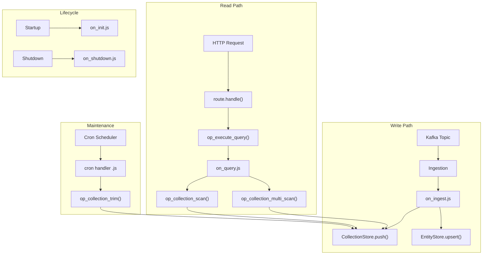

# X-Timeline Use Case Support

## Context

The X/Twitter Thunder reference uses specialized data structures -- `Arc<DashMap<i64, VecDeque<TinyPost>>>` -- for per-user timelines, with Kafka ingestion, periodic cron trimming, and multi-user scan queries. The current stateful-runtime only supports flat key-value entities (`DashMap<String, DashMap<String, EntityRecord>>`), a single `on_ingest` hook, and TTL-based retention. No cron, lifecycle, or query hooks exist.

## Architecture




## 1. Collection Entity Type (Schema + Store)

Add a new `collection` entity type to `schema.yaml` alongside the existing `record` type. Collections model `DashMap<String, VecDeque<CollectionItem>>` -- a partition-keyed, ordered list of items.

**[src/config/schema.rs](src/config/schema.rs):** Add `EntityType` enum and collection-specific fields to `EntitySchema`:

```rust
#[derive(Debug, Clone, Serialize, Deserialize, PartialEq, Eq, Default)]
#[serde(rename_all = "snake_case")]
pub enum EntityType {
    #[default]
    Record,
    Collection,
}

// Add to EntitySchema:
pub entity_type: EntityType,       // default: Record
pub partition_key: Option<String>, // required for Collection
pub order_by: Option<String>,      // field for ordering within partition
pub max_per_partition: Option<usize>,
```

**New file [src/store/collection.rs](src/store/collection.rs):**

```rust
pub struct CollectionItem {
    pub id: String,
    pub value: Value,
    pub created_at_ms: u64,
}

pub struct CollectionStore {
    collections: DashMap<String, DashMap<String, VecDeque<CollectionItem>>>,
    defs: HashMap<String, CollectionDef>,
    memory_bytes: AtomicUsize,
}
```

Methods:

- `push(name, partition_key, id, value)` -- push item to partition's deque, enforce `max_per_partition`
- `scan(name, partition_key, limit)` -- return newest-first items
- `multi_scan(name, partition_keys, limit_per_key)` -- scan across multiple partitions (like `get_posts_by_users`)
- `remove(name, partition_key, item_id)` -- remove specific item
- `len(name, partition_key)` -- count items in a partition
- `trim_expired(name, retention_seconds)` -- trim old items based on TTL
- `partition_count(name)` -- number of partitions

**[src/store/mod.rs](src/store/mod.rs):** Expose `CollectionStore` and add collection-aware `apply_ops` with new `StoreOpKind` variants (`Push`, `RemoveItem`, `TrimCollection`).

**[src/store/entity.rs](src/store/entity.rs):** Extend `StoreOpKind`:

```rust
pub enum StoreOpKind {
    Upsert,
    Delete,
    Push,        // collection push
    RemoveItem,  // collection remove by item id
}
```

## 2. Collection JS Ops

**[src/js/ops.rs](src/js/ops.rs):** Add new deno_core ops. The ops need `Arc<CollectionStore>` in OpState:

- `op_collection_push(collection_name, partition_key, item_json)` -- push item
- `op_collection_scan(collection_name, partition_key, limit)` -- scan partition, returns JSON array
- `op_collection_multi_scan(collection_name, partition_keys_json, limit_per_key)` -- multi-partition scan
- `op_collection_remove(collection_name, partition_key, item_id)` -- remove by ID
- `op_collection_len(collection_name, partition_key)` -- count
- `op_collection_trim(collection_name, max_age_seconds)` -- manual trim

This gives JS full access to both entity ops and collection ops.

## 3. Cron System

**[src/config/app.rs](src/config/app.rs):** Add `CronConfig` and a `crons` field to `AppConfig`:

```rust
pub struct CronConfig {
    pub name: String,
    pub interval_seconds: u64,
    pub handler: String,
}

// AppConfig:
pub crons: Vec<CronConfig>,
```

**New file [src/cron/mod.rs](src/cron/mod.rs):**

- `CronHandle` with `stop()` method (like `IngestionHandle`)
- `spawn_cron_tasks(config, js_pool, store, collection_store)` starts a tokio task per cron entry
- Each task uses `tokio::time::interval(Duration::from_secs(interval_seconds))`
- On tick, calls `js_pool.execute_cron(handler, cron_name)` which runs the cron JS script
- Cron script returns `StoreOp[]` (same contract as `on_ingest`)

**[src/js/mod.rs](src/js/mod.rs):** Add `execute_cron()` method to `JsRuntimePool` and load cron scripts.

**[src/js/runtime.rs](src/js/runtime.rs):** Add `execute_cron_handler()` function. Cron script contract:

```js
function on_cron(name) {
  // use collection ops directly via Deno.core.ops.*
  // return store ops array for entity operations
  return [];
}
```

## 4. Lifecycle Scripts

**[src/config/app.rs](src/config/app.rs):** Add `LifecycleConfig`:

```rust
pub struct LifecycleConfig {
    pub on_init: Option<String>,    // path to on_init.js
    pub on_shutdown: Option<String>, // path to on_shutdown.js
}

// AppConfig:
pub lifecycle: Option<LifecycleConfig>,
```

**[src/js/mod.rs](src/js/mod.rs):** Add `execute_lifecycle()` method. Load lifecycle scripts at init.

**[src/js/runtime.rs](src/js/runtime.rs):** Add `execute_lifecycle_handler()`. The script defines:

```js
function on_init() { /* setup logic, pre-warm collections */ }
function on_shutdown() { /* cleanup logic */ }
```

**[src/main.rs](src/main.rs):** Call `js_pool.execute_lifecycle("on_init")` after store+ingestion are ready. Call `on_shutdown` before stopping.

## 5. on_query Hook

**[src/config/app.rs](src/config/app.rs):** Add optional `queries` section:

```rust
pub struct QueryConfig {
    pub name: String,
    pub handler: String,
}

// AppConfig:
pub queries: Vec<QueryConfig>,
```

**[src/js/ops.rs](src/js/ops.rs):** Add `op_execute_query(query_name, params_json)` op that invokes the registered on_query handler via the JsRuntimePool.

**[src/js/mod.rs](src/js/mod.rs):** Load query scripts from `queries` config. Add `execute_query()` method.

**[src/js/runtime.rs](src/js/runtime.rs):** Add `execute_query_handler()`. Query script contract:

```js
function on_query(params) {
  const userIds = params.user_ids;
  const limit = params.limit || 50;
  const raw = Deno.core.ops.op_collection_multi_scan("user_timeline", JSON.stringify(userIds), limit);
  const posts = JSON.parse(raw);
  // filter, sort, deduplicate
  return posts.slice(0, limit);
}
```

Route handlers invoke queries: `Deno.core.ops.op_execute_query("get_feed", paramsJson)`.

## 6. Retention Integration

**[src/store/retention.rs](src/store/retention.rs):** Extend `spawn_retention_sweeper` to also trim collections. Call `collection_store.trim_all_expired()` on each sweep cycle. `RetentionSweepResult` gains a `trimmed_collection_items` field.

## 7. Wiring in main.rs

**[src/main.rs](src/main.rs):** Updated startup sequence:

1. Load bundle (existing)
2. Create `Store` and `CollectionStore` from schema
3. Create `JsRuntimePool` with both stores
4. Start retention sweeper (extended for collections)
5. **Execute `on_init` lifecycle hook** (new)
6. Start Kafka ingestion (existing)
7. **Start cron tasks** (new)
8. Build HTTP router, bind (existing)
9. On shutdown: **Execute `on_shutdown`**, stop crons, stop ingestion, stop retention

**[src/lib.rs](src/lib.rs):** Add `pub mod cron;`

## 8. Example Bundle: `examples/x-timeline/`

Demonstrates the full pattern modeled after Thunder PostStore:

- `**app.yaml`**: Kafka ingestion from `tweet-events`, cron for trimming every 5 min, lifecycle hooks, query definitions, feed + user_timeline endpoints
- `**schema.yaml`**: `post` (record) for full post data, `user_timeline` (collection) partitioned by `author_id`, ordered by `created_at`, max 500 per user, 48h TTL
- `**scripts/on_ingest.js`**: Parses tweet create/delete events, pushes to `user_timeline` collection and upserts to `post` entity
- `**scripts/on_init.js**`: Logs initialization
- `**scripts/crons/trim.js**`: Calls `op_collection_trim("user_timeline", 172800)` to remove expired posts
- `**scripts/queries/get_feed.js**`: Multi-scans user_timeline for a list of followed user IDs, filters deleted/self-retweets, sorts by created_at
- `**scripts/routes/feed.js**`: Accepts `user_id` + `limit` params, looks up following list, calls `op_execute_query("get_feed", ...)`, returns response
- `**scripts/routes/user_timeline.js**`: Scans a single user's timeline via `op_collection_scan`

## Files Summary


| Action | File                                                            |
| ------ | --------------------------------------------------------------- |
| Modify | `src/config/schema.rs` -- EntityType enum, collection fields    |
| Modify | `src/config/app.rs` -- CronConfig, LifecycleConfig, QueryConfig |
| Modify | `src/config/mod.rs` -- validation for new config sections       |
| Create | `src/store/collection.rs` -- CollectionStore implementation     |
| Modify | `src/store/mod.rs` -- integrate CollectionStore                 |
| Modify | `src/store/entity.rs` -- new StoreOpKind variants               |
| Modify | `src/store/retention.rs` -- collection trimming                 |
| Modify | `src/js/ops.rs` -- collection ops + query op                    |
| Modify | `src/js/mod.rs` -- load cron/query/lifecycle scripts            |
| Modify | `src/js/runtime.rs` -- cron/query/lifecycle execution           |
| Create | `src/cron/mod.rs` -- cron scheduler                             |
| Modify | `src/lib.rs` -- add cron module                                 |
| Modify | `src/main.rs` -- wire lifecycle, crons, collection store        |
| Create | `examples/x-timeline/app.yaml`                                  |
| Create | `examples/x-timeline/schema.yaml`                               |
| Create | `examples/x-timeline/scripts/on_ingest.js`                      |
| Create | `examples/x-timeline/scripts/on_init.js`                        |
| Create | `examples/x-timeline/scripts/crons/trim.js`                     |
| Create | `examples/x-timeline/scripts/queries/get_feed.js`               |
| Create | `examples/x-timeline/scripts/routes/feed.js`                    |
| Create | `examples/x-timeline/scripts/routes/user_timeline.js`           |


